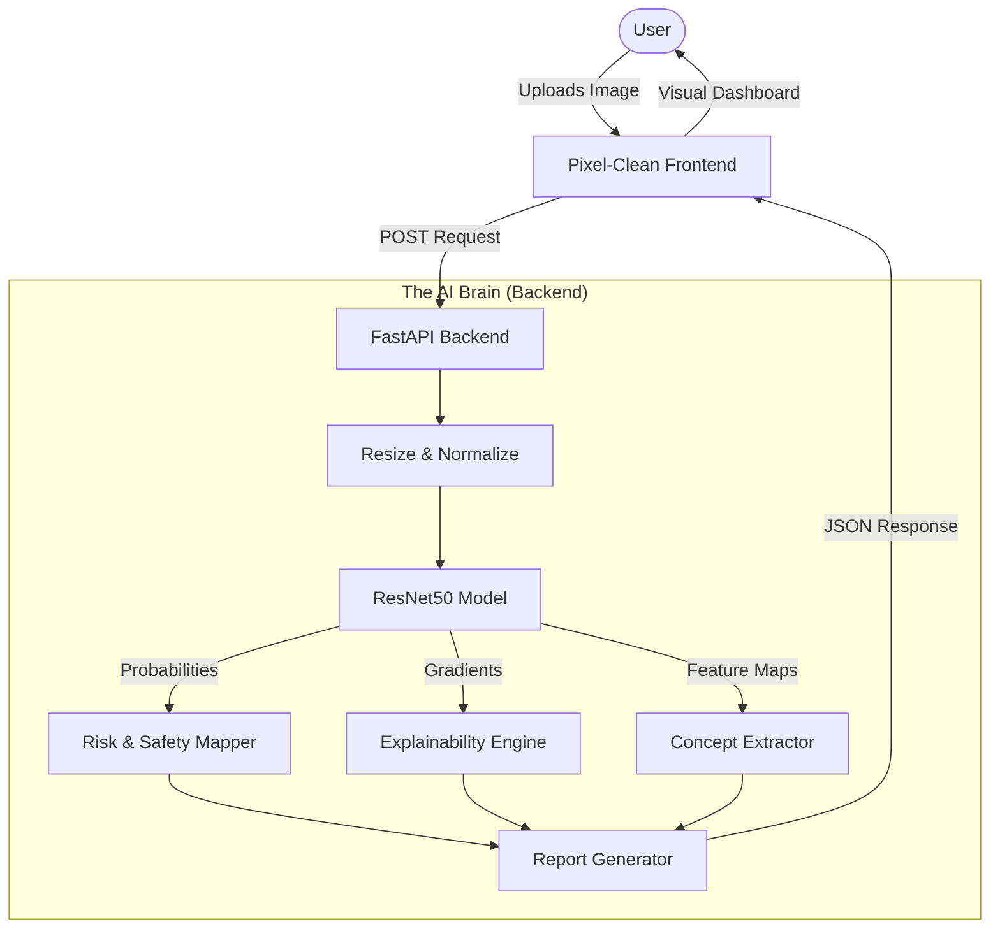
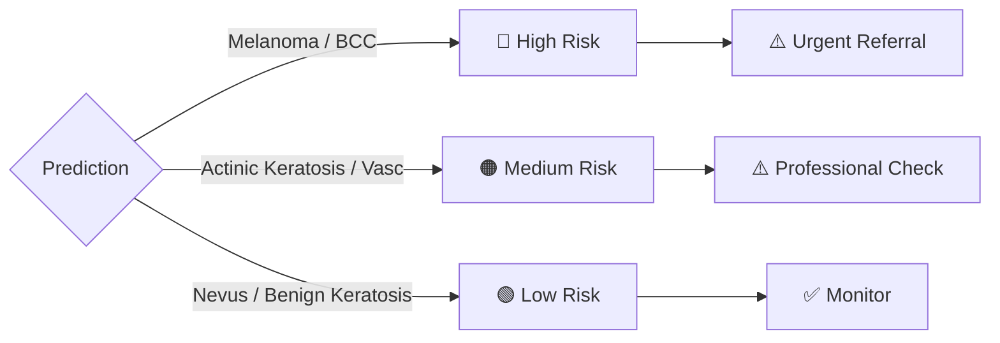

# 🎓 Explainable Skin Cancer Detection: The Complete Master Guide

**"An AI that doesn't just guess, but mimics a Dermatologist."**

---

## 📑 Table of Contents
1.  **Project Introduction** (What & Why?)
2.  **How It Works** (The Architecture)
3.  **Key Concepts Explained** (CNNs, ResNet, AI Explainability)
4.  **Project Structure** (Files & Folders)
5.  **Installation Guide** (Step-by-Step)
6.  **How to Run & Demo** (The Fun Part)
7.  **Troubleshooting**

---

## 1. 🏥 Project Introduction

### The Problem
Skin cancer is deadly but highly treatable if caught early. However, diagnosing it requires expert training to distinguish benign moles (like "nevi") from malignant ones (like "melanoma").
Standard AI models are "Black Boxes"—they define a risk score but don't tell you **why**, making them hard for doctors to trust.

### The Solution: "Glass-Box" AI
Our system uses **Deep Learning (ResNet50)** to classify skin lesions into 7 types, but adds **3 layers of Transparency**:
1.  **Visual Explainability**: Shows exactly which pixels triggered the decision.
2.  **Concept Extraction**: Analyzes "ABCDE" features (Asymmetry, Border, Color, etc.) just like a doctor.
3.  **Natural Language**: Writes a report explaining the diagnosis in plain English.

---

## 2. 🏗️ How It Works (Architecture)

### workflow of the Data
The image travels from the user's browser, through the AI brain, and back as a report.



### Risk Logic Flowchart
How we decide if it's Safe or Dangerous:


---

## 3. 🧠 Key Concepts Explained

### A. Convolutional Neural Networks (CNN)
Think of a CNN as a specialized eye.
- **Early Layers**: See simple lines and curves.
- **Middle Layers**: See textures (dots, blobs).
- **Deep Layers**: See complex medical patterns (irregular borders, blue-white veils).

### B. Transfer Learning (ResNet50)
Instead of training a brain from scratch (like a baby), we take a "university-educated" brain (ResNet50 trained on ImageNet) and "teach it a medical specialty" (Dermatology). This makes it smarter and faster with less data.

### C. Explainability (The "Why")
We use two methods to look inside the brain:
1.  **Grad-CAM (Gradient-weighted Class Activation Mapping)**:
    *   *Analogy*: Like a thermal camera showing "hotspots". It highlights general regions the model is looking at.
2.  **Integrated Gradients**:
    *   *Analogy*: Shows pixel-perfect detail. It tests "if I remove this specific pixel, does the confidence drop?"

### D. The ABCDE Rule
Dermatologists use this checklist. We mimic it using Computer Vision:
- **A**symmetry (Is one half different?)
- **B**order (Is it jagged?)
- **C**olor (Are there weird colors?)
- **D**iameter (Is it big?)
- **E**volving (Texture/complexity changes).

---

## 4. 📂 Project Structure

Your project folder on the Desktop looks like this:

```text
Skin_Cancer_Project/
├── backend/                  # The Brain (Python)
│   ├── main.py               # The Server Entrance
│   ├── models/               # The AI Model Logic
│   ├── explainability/       # Grad-CAM & IG Logic
│   ├── concepts/             # ABCDE Extraction Logic
│   └── utils/                # Helper tools
├── frontend/                 # The Face (HTML/CSS)
│   ├── index.html            # The Web Page
│   ├── styles.css            # The Look & Feel
│   └── app.js                # The Connectivity
├── demo_images/              # Verified Test Images
│   ├── High_Risk/
│   ├── Medium_Risk/
│   └── Low_Risk/
├── requirements.txt          # List of Python libraries
└── skin_cancer_model.pth     # The Trained AI Weights
```

---

## 5. ⚙️ Installation Guide (One-Time Setup)

#### Step 1: Open Terminal
Open **Command Prompt** or **PowerShell**.

#### Step 2: Go to the Folder
Type this (replace with your actual path if different):
```powershell
cd "C:\Users\Aravind Praveen\Desktop\Skin_Cancer_Project"
```

#### Step 3: Install Libraries
This downloads all the brain power (PyTorch, FastAPI, etc.):
```powershell
pip install -r requirements.txt
```
*(Wait for it to finish downloading everything).*

---

## 6. 🚀 How to Run & Demo

### Step 1: Start the Backend (The Engine)
In your terminal, inside the project folder, browse to `backend`:
```powershell
cd backend
python -m uvicorn main:app --reload
```
You should see: `Uvicorn running on http://127.0.0.1:8000`

### Step 2: Open the Frontend (The Dashboard)
No code needed here!
1.  Open your **File Explorer**.
2.  Go to `Skin_Cancer_Project > frontend`.
3.  Double-click **`index.html`**.
4.  It opens in your Chrome/Edge browser.

### Step 3: The Demo (Showing it off)
1.  Drag an image from the `demo_images` folder (e.g., `High_Risk/ISIC_0025964.jpg`).
2.  Drop it onto the webpage.
3.  Click **"Run AI Analysis"**.
4.  **Show the Examiners**:
    *   The **Risk Badge** (Red/Orange/Green).
    *   The **ABCDE Charts**.
    *   Scroll down to the **Heatmaps** (Prove it's not a black box!).
    *   Read the **AI Report**.

---

## 7. ❓ Troubleshooting

**Q: "The page says Error: Could not connect to backend."**
*   **Fix**: Did you close the black terminal window? Open it again and run the `uvicorn` command from Step 1.

**Q: "It says Vascular is Medium Risk, isn't that wrong?"**
*   **Answer**: No! Vascular lesions are benign, but they *look* like cancerous nodules ("mimickers"). Medium Risk is the correct safety precaution to avoid missing a difficult cancer.

**Q: "Can I use a random photo from my phone?"**
*   **Note**: The model was trained on **Dermoscopy** (microscope) images. Phone photos have shadows/flash that confuse it. For the best demo, use the images in `demo_images`.
